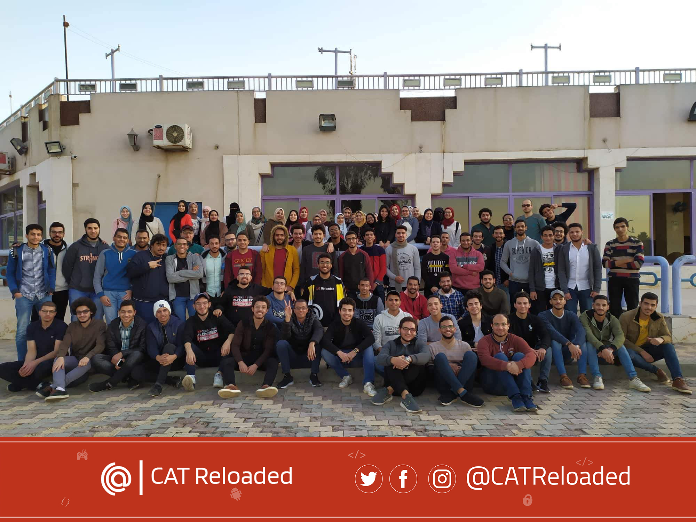

# Data-Science-Circle-RoadMap-2020

### our current roadmap for datascience circle at [CATReloaded](https://github.com/CATReloaded), prepared by [Nouran Ali](https://https://github.com/nouranali) and reviewed by Eng.Khalid Sulaiman.

## [CAT Reloaded](https://www.facebook.com/CATReloaded "CAT Reloaded")

------------

▶ What is [CAT Reloaded](https://www.facebook.com/CATReloaded "CAT Reloaded")?

📌 [CAT Reloaded](https://www.facebook.com/CATReloaded "CAT Reloaded") Abbreviation for **C**omputer **A**ssistance **T**eam was from **1996** and reloaded again so it gained its name **CAT Reloaded** from this matter.

------------

▶ What do we do in [CAT Reloaded](https://www.facebook.com/CATReloaded "CAT Reloaded")?

📌 The team is interested in forming technical circles in order to form communities that help and participate in learning modern software technology such as: **Computer science**, **Cyber Security**, **Gaming**, **Web Development**, **Mobile Development**, **Data Science**, **Embedded system** and **Graphic Design**.

------------

▶ How can you follow us on social media or offline?

📌 [CAT Reloaded](https://www.facebook.com/CATReloaded "CAT Reloaded") community in Mansoura, you know more about us and our activities through our social media:

💻[Web site](http://catreloaded.org/ "Web site")

💻[GitHub](https://github.com/CATReloaded "Web site")

📱 [Facebook Page](https://www.facebook.com/pg/CATReloaded "Facebook Page")

📱 [Facebook Group](https://www.facebook.com/groups/catreloaded.team "Facebook Group")

📱 [Twitter](https://twitter.com/CATReloaded "Twitter")

📱 [Linkedin](https://www.linkedin.com/company/cat-reloaded/ "Linkedin")

👓[YouTube](https://www.youtube.com/user/C4TReloaded "YouTube")

------------

▶ How to be a member of CAT Reloaded?

📌 Almost every year we host a recruitment [Event](https://www.facebook.com/events/375956410319681/?active_tab=discussion "Event") in Mansoura University to attract all of the interested students in Computer Science in general, categorizing them in Circles meant for different fields.

------------

## Before start you should know:
▶  So Why “Computer scince fundmintls”?
**If you need to climb stairs, you must tread the first stair.**
The CS fundamentals are the first stair in CS stairs, It will help you to understand how the computer works, how to deal with data, how to deal with code and many other things you should know to go freely on your career. Whatever the CS technology you choose to learn you need these fundamentals. 
Many people who decided to start directly learn one of CS technology suffering from a Lack of some skills and information and they wasting their times to go back and learn what they need and the process is repeated continuously.

## To be added soon: specialized content in CV,NLP,GANS.
